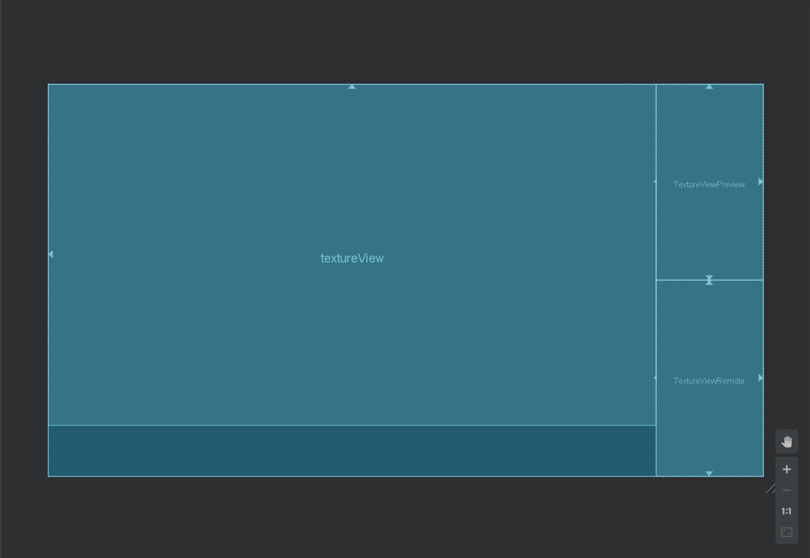
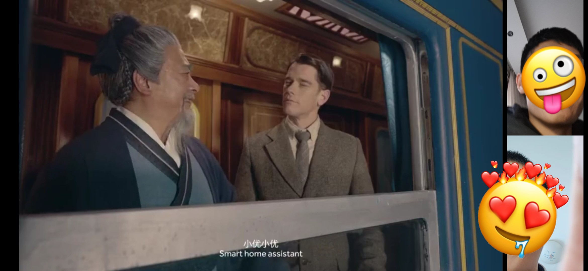

# 某电影院的开发手记

## 缘起

~~说来挺秃然的.jpg~~

最近参加了一个名叫“即构音视频应用编程创新挑战赛”的比赛，内容是使用[ZEGO SDK](https://zego.im)开发与音视频互动有关的应用。[这是文档](https://doc-zh.zego.im/zh/215.html)。

前段时间正好和同学聊起来在家和朋友连麦观影的事，于是就有了这个想法：能不能把“看电影”和“连麦”两件事集成一下呢？

## 开发思路

### 程序结构

采取了最简单的程序结构，包含三个 activity ，分别是主界面、创建房间界面和加入房间界面。用户使用时，创建房间的用户A会获得应用提供的一个房间口令；复制后发给用户B，使其得以加入这个房间。

### 主要业务逻辑代码

业务逻辑采取Java语言开发。共5个类，其中`idConfig.java`用来保存访问SDK所需的凭证，为了账户安全排除在git版本控制之外；`Filechoose.java`用来处理用户选择文件事件，参考了[这篇blog](https://blog.csdn.net/tracydragonlxy/article/details/103509238)的写法，特此致谢；此外的三个类分别对应上文提到的三个 activity。

#### CreateRoomActivity

用户进入这个 activity 的时候会收到应用提供的“房间口令”，本质上是一个UUID。同时，应用为当前用户创建username和userID（同样都是UUID）。

##### 自定义视频采集设置

自定义视频采集允许我们自己决定向 Zego Express Engine 推送什么画面。Zego 默认提供从摄像头采集画面并推送的自动化功能。要想推送媒体画面，还需要在引擎实例化之前进行配置。

创建`ZegoCustomVideoCaptureConfig`和`ZegoEngineConfig`对象，并进行相关设置。稍后可以将构造好的`ZegoEngineConfig`传入静态方法`setEngineConfig()`完成对引擎的配置。注意以下几点：

- 配置config要在引擎实例化之前完成；
- 引擎支持同时推两路流，可以只对其中一路设置自定义采集，另一路让其自动采集摄像头画面。
- 一定不要忘了调用`ZegoVideoConfig`类的`setEncodeResolution`方法，否则可能出现拉流端画面显示不全的问题。

##### 房间事件回调

监听`onRoomStreamUpdate`回调，可以在房间流更新的时候及时将相应画面显示在界面上。

##### 推流

房主端 activity 推两路流。主流传送前置摄像头采集到的人脸画面，辅流传送媒体播放器正在播放的画面。每个流都有自己的 ID ，可以使用前缀 + UUID 的方式定义一个 ID 。

不同于主流的是，辅流由于采用了自定义采集，需要我们手动调用`sendCustomVideoCaptureRawData`方法向流发送视频帧数据；对应音频数据可以混入别的流推送。

##### 拉流

收到房间事件回调时，若是新增流，则首先判断是否是自己推的流，如果不是，就检查流 ID 的前缀（已经约定好了）来决定把流的画面放到哪一个控件中。

##### 点击屏幕隐藏控件

当用户点击屏幕时，调用`hidejudge()`方法来判断用户是否点击了页面的空白处，判断成功则隐藏进度条、音量条、按钮等控件。

##### 解决选择文件和加载文件的异步处理问题

如果将选择文件和加载文件顺序地书写，加载文件的函数调用将会在文件管理器 activity 返回结果前执行造成空指针异常。为了解决这个问题，将界面操作逻辑设计为：选择和加载文件的过程分配在两次按钮点击的回调中。为了防止用户在加载文件之前就点击播放，设置成员变量`isPlayButtonDisabled`来控制是否禁用播放按钮。如此一来，只有当用户点击过加载文件后，才显示播放按钮。

##### 媒体播放器

没错！到了本程序的关键一环，电影院没了电影怎么活？

ZEGO提供了`ZegoMediaPlayer.createMediaPlayer()`方法，用于在已经创建ZEGO engine的前提下创建一个媒体播放器对象，引擎默认支持最多创建4个媒体播放器示例，在这里我们只需用到一个，故不必担心。

在播放器执行正常功能前需要先加载资源，ZEGO提供了`loadsource(String path,IZegoMediaPlayerLoadResourceCallback callback)`方法，
相应还有：

- `mediaplay.start()`

- `mediaplay.stop()`

- `mediaplay.pasue()`

- `mediaplay.resume()`

大体UI逻辑是：用户通过 选择文件 按钮选择文件，这时通过`opensystemfile()`方法会获得用户选定的视频路径，此时选择按钮变为 加载资源 按钮，这时按下此按钮会调用`loadsource`方法加载文件，加载资源后，其他UI图标出现，此时用户按下播放按钮即可开始播放。播放按钮按下后，变为 暂停 按钮。

音量控制使用一个seekbar控件，通过重写seekbar中`setOnSeekBarChangeListener`回调的`onProgressChanged`方法来获取当前seekbar即用户确定值，同时在回调中调用`mediaplayer.setVolum(int)`方法来设置视频音量。

进度控制同样使用seekbar控件，此控件承担两项功能。一，实时同步并显示当前播放进度；二，通过用户的拉取改变值，并用换算后的此值设置当前播放进度。

对于功能一，使用mediaplayer的`setEventHander`回调，在回调的`onMediaPlayerPlayingProgress`方法中获取当前播放进度`Progress`，换算后对进度控制seekbar调用`setProgress`方法，实时同步播放进。

对于功能二，与音量控制同方法，不过重写的是`onStopTrackingTouch`方法，在用户拉动seekbar停下后，使用seekbar的`getProgress`方法获取此值，换算后将此值设置为当前播放进度。

##### 媒体播放器抛出数据

`onVideoFrame`回调方法可以将媒体播放器抛出的帧画面传递给我们。我们可以在收到这一回调后调用`sendCustomVideoCaptureRawData`方法把获得的帧画面传送给引擎。注意：帧画面不含音频数据，我的解决方案是将正在播放的音频数据混合进入主流推送。

#### JoinRoomActivity

进入房间时，应用弹窗询问用户B收到用户A发送地房间 ID 。通过正确的 ID ，用户B可以进入用户A创建的房间。

##### 拉流

观众端不但要接收房主端的视频文件画面，还要接收房主端前置摄像头采集到的画面。可以在房间事件回调的`onRoomStreamUpdate`中遍历所有房主端的新增流，并分别在合适的控件显示其画面。

### 界面布局开发

在设置界面结构时，思虑良久，最后发现 两人的前置摄像头画面+共享视频画面并默认横屏 这种布局最为合理~~其实是太菜~~，如下图所示：

可以看出，ZEGO库中与视频画面显示相关的控件均为TextureView。

众所周知，安卓页面显示的在不同机型的适配是一大难题，本程序采用Google推荐的ConstraintLayout布局，并采用按百分比的布局方式，以防止TextrueViews之间相互覆盖的情况发生。

这里为了最简单地实现页面在不同机型的适配（，所有TextureView均以屏幕长作为参照，分别占父类0.85，0.15。其中，为了使屏幕的利用达到最大化，将TextureViewPreview与TextureViewRemote均设为占屏幕宽0.5。

这样所有TextureView就设置好啦。

最后，将activity背景设置为深灰色，~~提高B格~~改善画面感。

以上就是CreateRoomActivity和JoinRoomActivity的基本布局。

在HUAWEI ELE-AL00上的实机演示如下图：

另外CreateRoomActivity还需要媒体播放器控件的布局，正常处理，无需赘述